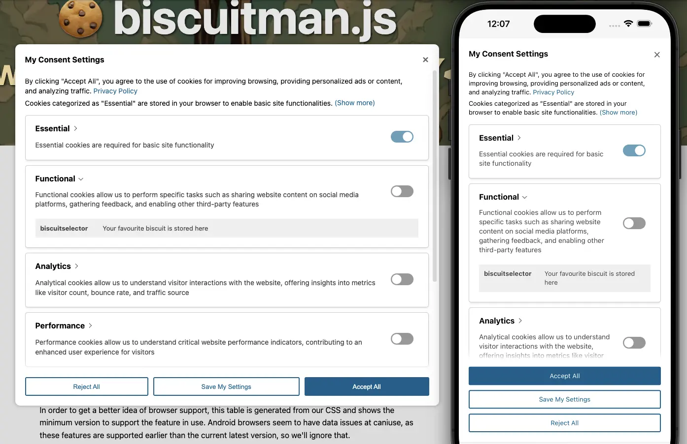

# biscuitman.js 🍪 Lightweight Consent Manager 



#### [View demo](https://replete.github.io/biscuitman)

100kB+ seemed too heavy for a cookie popup so I wrote this, it's around 4kB compressed including CSS, designed to be as small as possible and versatile enough for basic website 'cookie' consent management.

- Stores consent in `localStorage`, exposes in `window.Consent` and through custom events fired on `document`
- Handles consent granulated by custom sections (e.g. essential, performance, analytics...)
- Optionally shows user specific cookie (or localStorage item) details
	- Cookies/localstorage items removed on rejection/invalidation, if cookie details added
- Fully customizable strings so you can serve localized strings if you want
- Overridable localStorage key, consent global
- Basic color theming via CSS variables
- Simple flat configuration object
- Injects scripts when granular consent is granted (`<script data-consent="analytics" type="text/plain" src="..."></script>`)
- Injects embedded 'after' `<script>` from script tags with `src` properties on onload (= less markup)
- Mobile-first
- 'show more' functionality for long disclaimer text
- include optional link in any text
- CSS classes on `<html>` element for consents
- Progressively enhanced CSS
- Experimental ESM version included `biscuitman.mjs` (see [ESM demo](https://replete.github.io/biscuitman/index-esm.html))

## How to use
[View demo](https://replete.github.io/biscuitman) for a more detailed example

```html
<!--
	1. Prepare script tags
	   - set 'type' property to "text/plain" to prevent execution
	   - add 'data-consent' property with consent section name (e.g. analytics, functional, performance)
-->
<script data-consent="analytics" async src="https://www.googletagmanager.com/gtag/js?id=G-TEST" type="text/plain" id="js-analytics-gtm">
	// The contents of this script is injected after load, and ajacent to, parent script (convenience)
	console.log('GTM loaded:', !!google_tag_manager)
</script>
<script data-consent="analytics" type="text/plain" id="js-analytics-misc">
	console.log('This script runs as soon as analytics section consent is granted')
</script>

<!--
	2. Configure biscuitman settings
	   - window.biscuitman must be defined before biscuitman is loaded
	   - labels must be defined here as the library does not contain defaults for these strings (because they'll)
-->
<script>
	biscuitman = {
		/* Default properties */

		// key: 'myconsent',  // the key to store consent choices in localStorage
		// global: 'Consent',  // global window object to access consents at runtime
		// force: false,  // this forces the modal open at start and prevents website access without choosing consent
		// enableMore: true,   // Hide multiple lines of info text behind a 'show more' link to keep UI short
		// sections: ['essential'],   // a section is a group of consent choices, you must define your section names in configuration
		// title: 'Your privacy matters',   // Banner title
		// message: 'We use cookies',   // Banner message
		// settings: 'Settings',   // Settings button text
		// reject: 'Reject All',   // Reject button text
		// accept: 'Accept All',   // Accept button text
		// save: 'Save My Settings',   // Modal settings button text
		// settingsTitle: 'My Consent Settings',   // Modal title
		// info: ``,   // Multi-line information at top of modal
		// more: '(Show more)', // Show more button text
		// noCookies: 'No cookies to display', // Displayed in expanded sections within modal
		// acceptNonEU: false, // When enabled biscuitman checks browser locale timezone to see if it matches EU, if not it will auto consent
		dialogPolyfill: '/dist/dialog-polyfill.withcss.min.js', // set to false to disable dialog polyfill loading

		message: 'By clicking "Accept All", you agree to the use of cookies for improving browsing, providing personalized ads or content, and analyzing traffic. {link}',
		// {link} inside any configuration string will be replaced with an <a> link

		linkText: 'Privacy Policy',
		linkURL: 'https://domain.com/privacy-policy',

		// info uses a template literal in order to handle multiple lines, in case you have a long
		info: `Cookies categorized as "Essential" are stored in your browser to enable basic site functionalities.
Additionally, third-party cookies are utilized to analyze website usage, store preferences, and deliver relevant content and advertisements with your consent.
While you have the option to enable or disable some or all of these cookies, note that disabling certain ones may impact your browsing experience.`,

		// Define as many sections as desired, each section represents a granular consent and is fundamental to the software
		// You can name sections anything you want, but they must not use spaces or special characters
		// e.g. using data-consent="advertisment" would match 'advertisement'
		sections: ['essential','functional','analytics','advertisement','uncategorized'],

		// 'essential' is special because it doesn't need consent and its toggle is disabled in the UI
		essentialTitle: 'Essential',
		essentialMessage: 'Essential cookies are required to enable the basic features of this site',

		// The naming convention is {sectionName}Title, {sectionName}Message, and {sectionName}Cookies
		functionalTitle: 'Functional',
		functionalMessage: 'Functional cookies help perform functions like sharing the content of the website on social media platforms, collecting feedback, and other third-party features',
		advertisementTitle: 'Advertisement',
		advertisementMessage: 'Advertisement cookies serve to deliver tailored advertisements to visitors based on their previous page visits and to evaluate the efficacy of advertising campaigns',
		uncategorizedTitle: 'Uncategorized',
		uncategorizedMessage: 'Uncategorized cookies are those currently under analysis and have not yet been assigned to a specific category',
		analyticsTitle: 'Analytics',
		analyticsMessage: 'Analytical cookies are used to understand how visitors interact with the website. These cookies help provide information on metrics such as the number of visitors, bounce rate, traffic source, etc.',

		// (Optional) Include details of the cookies in use for a section, add them like a name/value dictionary
		// NOTE: By default, if these exist, then when when consent is rejected/invalidated, these cookies/localStorage entries will be immediately removed. Wildcards only work at the end of a string.
		analyticsCookies: {
			'_ga': 'This cookie, set by Google Analytics, computes visitor, session, and campaign data, tracking site usage for analytical reports. It stores information anonymously, assigning a randomly generated number to identify unique visitors',
			'_ga_*': 'Google Analytics uses this cookie for storing page view count'
		}
	}
</script>

<!--
	3. Include Biscuitman files:
-->
<script src="biscuitman.withcss.min.js"></script>

<!-- or, if you want to load CSS separately: -->
<head>
	<link rel="stylesheet" href="biscuitman.min.css"/>
	<script src="biscuitman.min.js"></script>
</head>

```

## Experimental ESM version

ESM version supplied as an alternative packaging format. Long-term it's better to not have two versions, so this may or not become the main version. Consider it an alternate packaging format at this point. ([ESM demo](https://replete.github.io/biscuitman/index-esm.html))

```html
<!-- Experimental ESM version: -->
<script type="module" id="biscuitman-init">
	import biscuitman from './dist/esm/biscuitman.withcss.mjs';
	let bm = biscuitman.create({
		// ...options
	}).on('save', data => {
		// optional event callback
		console.log('ESM version: consents were saved', data.data)
	}).on('revoke', data => {
		// optional event callback
		if (data.section === 'analytics') {
			console.log('ESM version: analytics was revoked')
		}
	})
</script>
```

## Theme CSS

It's easy enough to theme the included styles by overriding CSS variables. They are shortened but straightforward:

```css
/* hacker mode */
.biscuitman {
	--c: limegreen;
	--bg: #000;
	--tx: #fff;
	--ui: 255,255,255;
	font-family: monospace;
}
/* Dark mode */
@media (prefers-color-scheme: dark) {
	.biscuitman {
		--c: #1586c6;
		--bg: #000;
		--tx: #fff;
		--ui: 255,255,255;
	}
}
```

The banner height is applied as a px value to the `var(--bm-height)` css variable on html so that you can add an offset style when it is visible to make sure no content is obscured by the banner. This is an offset fix that uses generated content, but you might implement something else based on margin/padding depending on your site layout design.
```css
html.bm-show::after {
	content:'';
	min-height:var(--bm-height);
	/* min-height: calc(var(--bm-height) + 20px) */;
	display:block;
}
```

## Browser Support

Biscuitman is written in modern Javascript and transpiled with `swc` to target browsers less than two years old. The included distributables are tested to support the following browsers:

- Chrome/Edge/Opera: 85+ (released June 2020)
- Firefox: 98+ (released March 2022)
- Safari (inc iOS): 15.4+ (released March 2022)
- Samsung Internet: 14+ (released April 2021)

### \<Dialog\> polyfill

To support older than the browsers above, a polyfill for `<dialog>` is required. Biscuitman checks for this automatically and loads a [polyfill for dialog](https://github.com/GoogleChrome/dialog-polyfill) on-demand (if it is not already loaded), and then correctly binds the UI.

For this to work, you must host `dist/dialog-polyfill.withcss.js` and set the config property `dialogPolyfill` to the correct URL.

This will extend the browser support to:
- Safari (inc iOS) 13.1+ (released March 2020)
- Firefox 77+ (released June 2020)
- Firefox Android 79+ (released August 2020)

If the dialog polyfill is already loaded (`window.dialogPolyfill` exists), the polyfill will not be loaded again. To disable this on-demand functionality altogether, set `dialogPolyfill` property to `false`.

### Legacy Browser Support

If you need to support really old browsers, use `biscuitman-legacy.js`, `biscuitman-legacy.min.js` or `biscuitman-legacy.withcss.js` to extend the browser support to:
- Safari 7+ / 6.2+ (released Oct 2013)
- Chrome 30+ (released Oct 2013)
- Firefox 24+ (released Sep 2013)
- Chrome 24+ (released Jan 2013)
- IE 11+ (released Oct 2013)

This legacy version is transpiled to ES5 and includes required polyfills to make itself functional on these ancient browsers. This makes the distributables roughtly double the filesize of the modern versions.

In these extremely old browsers, the functionality is intact and the UI is usable but it may look slightly janky as the browser is missing CSS features like `gap` resulting in missing gaps between buttons.


## Globals
- `biscuitman` – configuration object, must be `window.biscuitman`
	- `biscuitman.create(options)` for the ESM version
- `Consent` – object for accessing consents (override: `global` in config)
	```
	{
		"consentTime": 1717846660979,
		"functional": false,
		"analytics": false,
		"performance": false,
		"advertisement": false,
		"uncategorized": false
	}
	```
	- example usage: `if (Consent.analytics) { doAnalyticsThing() }`
- `bmInvalidate()` – Delete stored consent data and reinstate UI (you might use this in your app code)
- `bmOpen()` – Opens My Consent Settings modal (you might want to link this on your Privacy policy or footer nav)
	- example usage: `<a href="javascript:bmOpen();"> Update my consent settings</a>`


## CSS Classes

- `biscuitman` on UI container
- `bm-{sectionName}`, `bm-no-{sectionName}`, `bm-show` and sometimes `bm-dialog-polyfill` on `<html>`
- `--bm-height` CSS variable written to `<html style="--bm-height:0px;">`

## Events

Custom events prefixed with `bm:` are fired on `document`. The easiest way to see how events work is to view the `console.debug()` calls in the [demo](https://replete.github.io/biscuitman).
- `bm:open` => `{time: 1718915128298}` modal opened
- `bm:close` => `{time: 1718915128298}` modal closed
- `bm:button` => `{id: "settings", time: 1718915128298}` button clicked
- `bm:save` => `{data: {consentTime: 1718914784624, advertisement:true, advertisement: fal..}, time: 1718914784624}` consent choice saved
- `bm:inject` =>  `{el: $Element, parent?: $Element, id?: 'script-id', time: 1718914784624}` script injected to DOM. if parent exists, it's a new tag inserted after a `src` script loaded which also had text content (a 'dependent' script = tidier convenient markup)
- `bm:invalidate` => `{data: {...consentObjectJustDeleted}, time: 1718915128298}` consent invalidated
- `bm:revoke` => `{section: 'analytics', time: 1718914784624}` returns section that was revoked if updated consent changed from true to false
- `bm:update` => `{data: {...currentConsentObject}, time: 1718914784624}` returns current consent object and time
- `bm:delete` => `{localStorage|cookie: 'cookieName', time: 1718914784624}` fires when consent is rejected or invalidated and cookies/localStorage entries are deleted

You can watch for these events like this:
```js
document.addEventListener('bm:save', ({ detail }) => {
	let { data, time } = detail
	console.log(data)
})
```

## Development

`npm run dev` fires up a browserSync development server on `https://localhost:3000`.

We need `https://` to be able to delete Secure cookies.


### Fix NET::ERR_CERT_AUTHORITY_INVALID error

To prevent invalid certificate warnings, you can generate a local SSL key with `mkcert`:
- Install `mkcert` ([Installation instructions](https://github.com/FiloSottile/mkcert#installation)) and then run:
- run `npm run makecerts`, to generate `server.crt` and `server.key` for browserSync dev server
- if you're using another solution for local SSL certs, generate `server.crt` and `server.key` manually and place them in the root

Visiting `https://localhost:3000` should now work without warnings.

### Building
`npm run build` - creates project distributes via `run.js`, a custom build script requiring `Node v20`

### Tests
Jest is set up with puppeteer to run some integration tests. We're using `@swc/jest`'s rust implementation of jest to speed things up.

`npm run test` - Launches pupeeter integration tests in a browser (in http mode only)

`npm run coverage` - run jest tests with coverage saved to `/coverage/`


## Support development

<a href="https://www.buymeacoffee.com/replete"></a>
