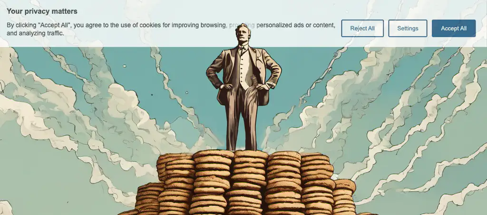

# biscuitman.js 🍪 Lightweight Consent Manager


#### [View demo](https://replete.github.io/biscuitman)

I didn't like sending 100KB+ for a simple cookie consent solution so I wrote this. It's currently **3.1kB/br or 3.6kB/gz**, including CSS. It's designed to be as small as possible with an adequate featureset for basic website cookie consent.

- Stores consent in `localStorage`, exposes in `window.Consent` and through custom events fired on `document`
- Handles consent granulated by custom sections (e.g. essential, performance, analytics...)
- Optionally shows user specific cookie details
- Cookies/localstorage items removed on rejection/invalidation, if cookie details added 
- Fully customizable strings so you can serve localized strings if you want
- Overridable localStorage key, consent global
- Simple flat configuration object
- Injects scripts when granular consent is granted (`<script data-consent="analytics" type="text/plain" src="..."></script>`)
- Injects embedded `<script>` from script tags with `src` properties on onload (tidier markup)
- Works without CSS (thanks to `<dialog>` and `<details>`)
- Mobile-first
- Browser support: >= 2% browserlist (No IE support, but its not impossible)
  - Written with latest CSS / JS features and targetted to >= 2% using browserlist
- show more functionality for long disclaimer text
- link for privacy policy in any string


## How to use
```html
<!-- 
	1. Prepare script tags
	   - set 'type' property to "text/plain" to prevent execution
	   - add 'data-consent' property with consent section name (e.g. analytics, functional, performance)
-->
<script data-consent="analytics" async src="https://www.googletagmanager.com/gtag/js?id=G-TEST" type="text/plain" id="js-analytics-gtm">
	// The contents of this script is injected when the parent script is loaded, for convenience
	console.log(google_tag_manager)
</script>
<script data-consent="analytics" type="text/plain" id="js-analytics-gtm-after">
	console.log('This script runs as soon as analytics section consent is granted')
</script>

<!-- 
	2. Configure biscuitman settings
	   - window.biscuitman must be defined before biscuitman is loaded
	   - labels must be defined here as the library does not contain defaults for these strings (because they'll)
-->
<script>
	biscuitman = {
		/* Default properties */

		// storageKey: 'myconsent',  // the key to store consent choices in localStorage
		// global: 'Consent',  // global window object to access consents at runtime
		// force: false,  // this forces the modal open at start and prevents website access without choosing consent
		// enableMore: true,   // Hide multiple lines of info text behind a 'show more' link to keep UI short
		// sections: ['essential'],   // a section is a group of consent choices, you must define your section names in configuration
		// title: 'Your privacy matters',   // Banner title
		// message: 'We use cookies',   // Banner message
		// settings: 'Settings',   // Settings button text
		// reject: 'Reject All',   // Reject button text
		// accept: 'Accept All',   // Accept button text
		// save: 'Save My Settings',   // Modal settings button text
		// settingsTitle: 'My Consent Settings',   // Modal title
		// info: ``,   // Multi-line information at top of modal
		// more: '(Show more)', // Show more button text
		// noCookies: 'No cookies to display', // Displayed in expanded sections within modal
		// acceptNonEU: false, // When enabled biscuitman checks browser locale timezone to see if it matches EU, if not it will auto consent

		message: 'By clicking "Accept All", you agree to the use of cookies for improving browsing, providing personalized ads or content, and analyzing traffic. {link}',
		// {link} inside any configuration string will be replaced with an <a> link

		linkText: 'Privacy Policy',
		linkURL: 'https://domain.com/privacy-policy',

		// info uses a template literal in order to handle multiple lines, in case you have a long
		info: `Cookies categorized as "Essential" are stored in your browser to enable basic site functionalities. 
Additionally, third-party cookies are utilized to analyze website usage, store preferences, and deliver relevant content and advertisements with your consent.
While you have the option to enable or disable some or all of these cookies, note that disabling certain ones may impact your browsing experience.`,
		
		// Define as many sections as desired, each section represents a granular consent and is fundamental to the software
		// You can name sections anything you want, but they must not use spaces or special characters
		// e.g. using data-consent="advertisment" would match 'advertisement'
		sections: ['essential','functional','analytics','advertisement','uncategorized'],

		// 'essential' is special because it doesn't need consent and its toggle is disabled in the UI
		essentialTitle: 'Essential',
		essentialMessage: 'Essential cookies are required to enable the basic features of this site',
		
		// The naming convention is {sectionName}Title, {sectionName}Message, and {sectionName}Cookies
		functionalTitle: 'Functional',
		functionalMessage: 'Functional cookies help perform functions like sharing the content of the website on social media platforms, collecting feedback, and other third-party features',
		advertisementTitle: 'Advertisement',
		advertisementMessage: 'Advertisement cookies serve to deliver tailored advertisements to visitors based on their previous page visits and to evaluate the efficacy of advertising campaigns',
		uncategorizedTitle: 'Uncategorized',
		uncategorizedMessage: 'Uncategorized cookies are those currently under analysis and have not yet been assigned to a specific category',
		analyticsTitle: 'Analytics',
		analyticsMessage: 'Analytical cookies are used to understand how visitors interact with the website. These cookies help provide information on metrics such as the number of visitors, bounce rate, traffic source, etc.',
		
		// (Optional) Include details of the cookies in use for a section, add them like a name/value dictionary
		// NOTE: By default, if these exist, then when when consent is rejected/invalidated, these cookies/localStorage entries will be immediately removed. Wildcards only work at the end of a string.
		analyticsCookies: {
			'_ga': 'This cookie, set by Google Analytics, computes visitor, session, and campaign data, tracking site usage for analytical reports. It stores information anonymously, assigning a randomly generated number to identify unique visitors',
			'_ga_*': 'Google Analytics uses this cookie for storing page view count'
		}
	}
</script>

<!-- 
	3. Include biscuitman.withcss.min.js if you want the CSS included
-->
<script src="biscuitman.withcss.min.js"></script>

<!--   or include separately: -->
<script src="biscuitman.min.js"></script>

<style>@import url(biscuitman.min.css);</style>
<link rel="stylesheet" href="biscuitman.min.css"/>
```

If you want to make sure website content obscured underneath the banner, add these styles to your website CSS:
```css
html:not(:has(.bm-hide))::after {
	content:'';
	min-height:300px;
	display:block;
	user-select:none;
}
```

## Globals
- `biscuitman` – configuration object, must be `window.biscuitman`
- `Consent` – object for accessing consents (add `global` config property to override)
	```
	{
		"consentTime": 1717846660979,
		"functional": false,
		"analytics": false,
		"performance": false,
		"advertisement": false,
		"uncategorized": false
	}
	```
	- example usage: `if (Consent && Consent.analytics) { doAnalyticsThing() }`
- `bmInvalidate()` – Delete stored consent data and reinstate UI
- `bmOpen()` – Opens My Consent Settings modal
	- example usage: `<a href="javascript:bmOpen();"> Update my consent settings</a>` 

## Events

The easiest way to see how events work is to view the `console.debug()` calls in the [demo](https://replete.github.io/biscuitman)
- `biscuitman:open` => `{time: 1718915128298}` modal opened
- `biscuitman:close` => `{time: 1718915128298}` modal closed
- `biscuitman:button` => `{id: "settings", time: 1718915128298}` button clicked
- `biscuitman:save` => `{data: {consentTime: 1718914784624, advertisement:true, advertisement: fal..}, time: 1718914784624}` consent choice saved
- `biscuitman:inject` =>  `{el: $Element, parent?: $Element, time: 1718914784624}` script injected to DOM. if parent exists, it's a new tag inserted after a `src` script loaded which also had text content (a 'dependent' script = tidier convenient markup)
- `biscuitman:invalidate` => `{data: {...consentObjectJustDeleted}, time: 1718915128298}` consent invalidated
- `biscuitman:update` => `{data: {...currentConsentObject}, time: 1718914784624}` returns current consent object and time
- `biscuitman:delete` => `{localStorage|cookie: 'cookieName', time: 1718914784624}` fires when consent is rejected or invalidated and cookies/localStorage entries are deleted
	
You can watch for these events like this:
```js
document.addEventListener('biscuitman:open', (e) => {
	console.log('modal opened')
}, true);
```

## Development

Fire up a browsersync dev server on `:3000`. `index.html` will display as the dev sandbox.
```bash
npm install
npm run dev
```

### Building
`npm run build`

## Support development

<a href="https://www.buymeacoffee.com/replete"></a>